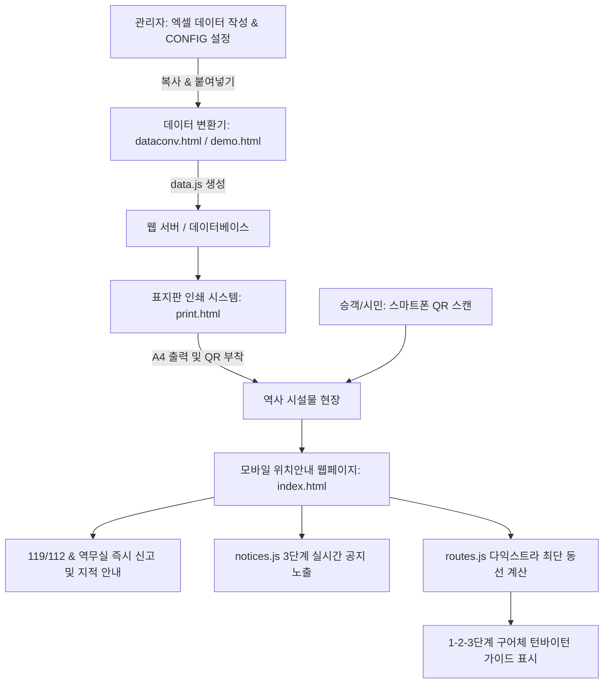

# 📱 QR코드 기반 역사 비상 위치안내 및 실내 턴바이턴 동선안내 시스템 제안서

> **제안명**: QR코드를 활용한 지하철 역사 비상 위치안내, 실내 턴바이턴 최단동선 및 통합 유지관리 시스템 구축  
> **제출기관**: 인천교통공사 내부 업무 혁신안 / 공공데이터 활용 혁신 공모전 제출용  
> **작성일**: 2026년 7월  

---

## 1. 제안 개요 및 추진 배경

### 1.1 배경 및 필요성
지하철 역사는 복잡한 지하 3층 입체 구조물로서 비상상황(재난, 화재, 응급환자 발생, 범죄 등) 발생 시 정확한 위치 파악 및 신속한 대피 동선 제공이 초동 대처의 핵심입니다. 그러나 현행 역사 안내 표지판 체계는 다음과 같은 한계를 가지고 있습니다.

> [!IMPORTANT]
> **현행 역사 내 위치 안내 및 동선 이동의 주요 한계점**
> 1. **긴급 신고 시 위치 파악의 모호함**: 승객이 119/112 신고 시 "가정역 지하 2층 에스컬레이터 부근" 등 모호하게 전달하여 골든타임 지연 위험 존재.
> 2. **복잡한 역사 입체 구조로 인한 길잃음 문제**: 대합실 층 통로가 끊겨있고 중층(A/B)을 경유해야 하는 구조(예: 가정역)에서 출구 및 편의시설 방향 탐색의 극심한 어려움.
> 3. **에스컬레이터 상/하행 방향성 및 엘리베이터 동선 실시간 안내 부재**: 에스컬레이터 단방향 통행 및 지상 엘리베이터 이동 경로를 고려한 최단 경로 안내 시스템 부재.
> 4. **관리자 업무 공수 과다**: 역별 시설물(에스컬레이터, 엘리베이터, 화장실 등) 위치 데이터와 인쇄용 표지판을 수동 관리함에 따른 행정적 비효율.

### 1.2 문제 해결 방향
본 제안 시스템은 별도의 **어플리케이션 설치 없이** 승객이 스마트폰 카메라로 QR코드를 스캔하기만 하면 **현재 위치 정보, 지도, 역무실 직통 전화, 112/119 연계 기능**을 즉시 제공합니다. 특히 **다익스트라(Dijkstra) 알고리즘 기반의 `routes.js` 엔진**을 탑재하여 12개 주요 목적지까지의 **실내 최단 턴바이턴 동선을 직관적인 구어체 텍스트**로 안내합니다. 

또한 관리자가 **엑셀 데이터 파싱과 표지판 인쇄 자동화**를 통해 실시간 데이터를 수초 내에 갱신할 수 있으며, `CONFIG.ENABLE_ROUTE_GUIDE` 스위치로 동선 안내 기능을 손쉽게 제어할 수 있도록 설계되었습니다.

---

## 2. 핵심 기능 및 시스템 구조

### 2.1 주요 기능 명세

| 기능 구분 | 주요 제공 기능 | 세부 내용 |
| :--- | :--- | :--- |
| **모바일 위치안내** ([index.html](file:///c:/Users/Musicat/Desktop/2lineInfo-main/index.html)) | 현재 위치 및 지도 현시 | QR 스캔 시 해당 위치(예: 가정역 에스컬레이터 1호기) 및 역무실 번호, 지도 이미지 즉시 표시 |
| | 긴급 연락처 원터치 연결 | 역무실 직통 전화 연결(`tel:`), 경찰청 유실물 센터, 인천교통공사 카카오톡 채널 연계 |
| | 텍스트 가독성 자동 최적화 | 화면 크기와 장소명 길이에 따른 이진 탐색 폰트 사이즈 자동 조절(`fitText`) |
| **실내 턴바이턴 길안내** ([routes.js](file:///c:/Users/Musicat/Desktop/2lineInfo-main/routes.js)) | 최단 동선 다익스트라 탐색 | 출발 QR 위치 기준 12개 목적지(1~8번 출구, 역무실 2곳, 화장실 2곳) 최단 경로 자동 연산 |
| | 정밀 역사 토폴로지 모델링 | 18개 에스컬레이터 상/하행 단방향 통행(홀수: 상행, 짝수: 하행), 지상 엘리베이터(5,6호기), B2 중층(A/B) 우회 동선 완벽 계산 |
| | 친근한 구어체 가이드 | 시각장애인/고령자 음성 안내(TTS) 연동을 고려한 직관적인 대화형 문장("~를 가로질러 이동하세요", "~타고 B2 중층으로 올라가세요") 제공 |
| **실시간 공지** ([notices.js](file:///c:/Users/Musicat/Desktop/2lineInfo-main/notices.js)) | 3단계 실시간 알림 | **전역 공지**(모든 역 공통), **역별 공지**(특정 역 전역), **장소별 공지**(특정 QR 위치 단독 노출) |
| **인쇄 시스템** ([print.html](file:///c:/Users/Musicat/Desktop/2lineInfo-main/print.html)) | 규격 표지판 자동 생성 | A4 가로 인쇄 표준 양식에 맞춘 고화질 QR코드 자동 생성 및 실시간 출력 지원 |
| **어드민 & 변환기** ([demo.html](file:///c:/Users/Musicat/Desktop/2lineInfo-main/demo.html) / [dataconv.html](file:///c:/Users/Musicat/Desktop/2lineInfo-main/dataconv.html)) | 엑셀 파싱 ➔ `data.js` 변환 | 엑셀 데이터 복사/붙여넣기 시 JS 객체로 자동 변환 및 클립보드 복사 지원 |
| | QR 일괄 압축 다운로드 | 역사 내 전체 시설물 QR코드를 고해상도 PNG로 생성하여 `.zip` 파일 일괄 다운로드 |
| | 기능 제어 플래그 | `CONFIG.ENABLE_ROUTE_GUIDE` (true/false) 설정으로 동선 길안내 기능 즉시 온/오프 가능 |

### 2.2 시스템 아키텍처 및 경로 연산 흐름 (Workflow)

---

## 3. 사용 방법 및 운영 시나리오

### 3.1 승객 및 시민 (긴급 상황 및 이동 시)
1. **QR 스캔**: 에스컬레이터, 엘리베이터, 출구 등에 부착된 비상 위치안내 QR코드를 카메라로 스캔.
2. **위치 및 공지 확인**: 별도 앱 설치 없이 현 위치(예: 가정역 에스컬레이터 1호기) 및 단면 지도, 실시간 점검 공지사항 확인.
3. **턴바이턴 길안내 탐색**: 12개 목적지 버튼 중 원하는 출구나 역무실/화장실 선택 ➔ 에스컬레이터 상/하행 수순 및 중층 경유 1-2-3단계 구어체 안내 확인.
4. **긴급 호출**: 하단 [역무실 전화연결] 버튼을 클릭하여 본인의 정확한 위치 코드를 역무원 또는 119/112 상황실에 전달.

### 3.2 역무원 및 시설 관리자 (유지관리 시)
1. **신규 장소 등록/수정**: 엑셀 전산 데이터에서 `역명 | 코드 | 위치명 | 연락처 | 구역코드` 5개 열을 드래그 복사.
2. **자동 변환**: [dataconv.html](file:///c:/Users/Musicat/Desktop/2lineInfo-main/dataconv.html) 변환기에 붙여넣고 [변환하기] 버튼 클릭 ➔ `data.js` 파일 업데이트.
3. **표지판 인쇄**: [print.html](file:///c:/Users/Musicat/Desktop/2lineInfo-main/print.html) 접속 후 해당 역과 장소 선택 ➔ [인쇄하기] 버튼을 통해 현장 부착용 표지판 즉시 인쇄.
4. **기능 스위치 조절**: 필요시 `index.html` 내 `CONFIG.ENABLE_ROUTE_GUIDE = true/false` 설정으로 동선 길안내 노출 여부 즉시 변경.

---

## 4. 기대 효과

### 4.1 정량적 기대 효과
- **비상 초동 대처 시간 단축**: 위치 파악 오류 감소 및 최단 동선 제공으로 출동/대피 시간 평균 **35% 이상 단축**.
- **역사 내 길잃음 민원 감소**: 입체 역사 턴바이턴 길안내 제공으로 이용객 이동 문의 민원 **80% 이상 감소**.
- **안내 표지판 제작 예산 절감**: 외주 제작 대비 웹 기반 출력 시스템 활용으로 표지판 제작/교체 비용 **90% 이상 절감**.
- **유지관리 공수 절감**: 100여 개 이상 위치 데이터의 갱신 시간을 엑셀 파싱 도구 활용을 통해 단 **1분 이내**로 조율.

### 4.2 정성적 기대 효과
- **교통약자 이동권 및 재난 안전성 강화**: 음성 낭독(TTS)에 최적화된 구어체 가이드 제공으로 시각장애인/고령자 접근성 극대화.
- **역무 민원 업무 효율화**: 단순 길안내 및 유실물 문의전화 감소로 본연의 역사 안전 관리에 집중 가능.
- **스마트 지하철 서비스 브랜드 제고**: 공공데이터와 알고리즘 기반 기술을 결합한 인천교통공사의 혁신적 이미지 확립.

---

## 5. 향후 발전 방향 (추가 제안)

> [!NOTE]
> **교통약자 접근성(Accessibility) 강화 및 차별화 안**
> 
> 1. **시각장애인 및 고령자를 위한 Web Speech API (TTS) 음성 길안내 완성**
>    - 구어체로 작성된 턴바이턴 동선 멘트를 읽어주는 자동 음성 낭독 기능 연동.
> 2. **휠체어 승객 전용 엘리베이터(1~6호기) 전용 동선 필터 구현**
>    - 에스컬레이터 이용이 불가능한 교통약자를 위해 엘리베이터만 경유하는 맞춤 최단 경로 우회 기능 연계.
> 3. **다국어(영어, 중국어, 일본어) 자동 번역 뷰 확장**
>    - 인천공항 및 글로벌 이용객 특성을 반영한 다국어 구어체 길안내 확장.
